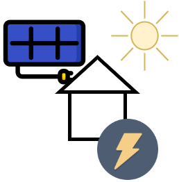

# Residual Load Forecasting Challenge

Welcome to our industry challenge. 

## Challenge Description

The decentralized expansion of renewable energies is an important pillar on the way to the energy transition. Self-generation systems on industrial and commercial sites are a major field of application. Primarily, customers use a certain amount of the electricity they generate themselves and only feed any surpluses into the public grid or purchase electricity if the quantities generated are insufficient. The resulting residual load must in any case be provided by the utility (load generation=residual load). In the past, the supplier could rely on many years of experience and load time series. Due to weather-dependent, fluctuating generation, the resulting loads can no longer be trivially forecast. However, this is necessary to maintain a proper supply operation. For this reason, it is necessary to have a forecast of the residual load that is as accurate as possible.

## How to Attend

1. Attend our Kick-Off at the 15.12.2022 
2. If you did not attend the Kick-Off, contact us
3. Start developing your forecasting algorithm
4. Train your algorithm using [train.csv](train.csv) 

## How to Submit

1. Create a solution submission by forecasting the required data from [test.csv](test.csv)
2. Send us your solution :)

## Prizes

We will give away prices at the end of the competition

## Timeline

- Challenge Kickoff 15.12.2022
- Challenge End X

## Data Description

bliblablub

## Evaluation Criteria

root mean squared error...